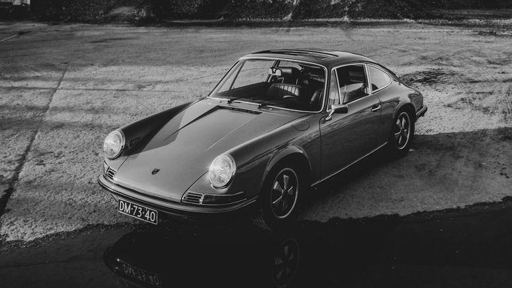
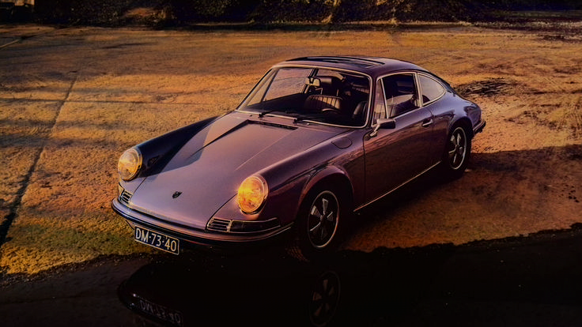
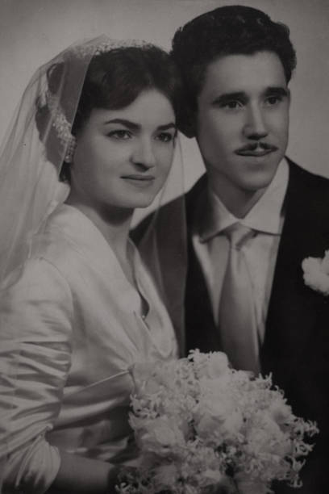
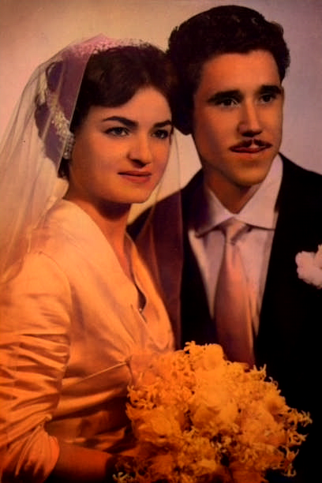
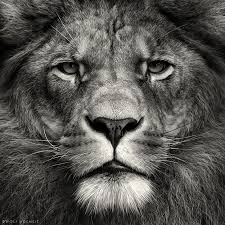
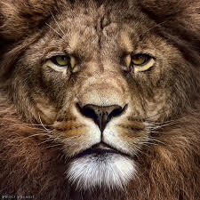
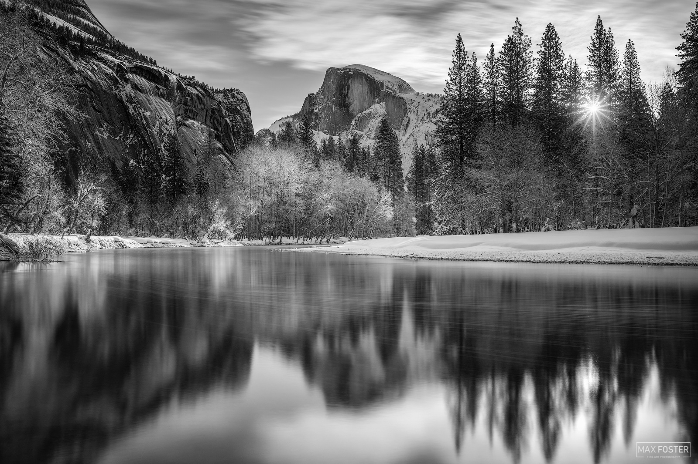
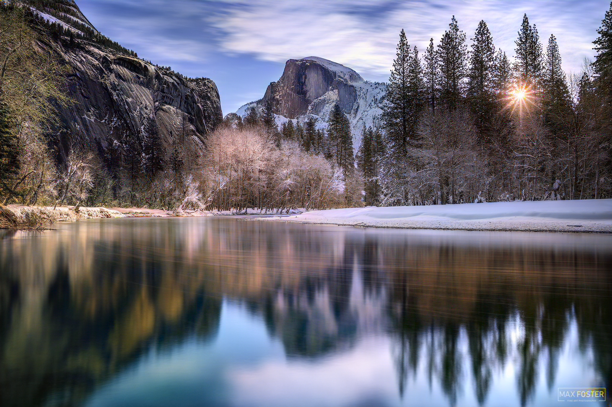
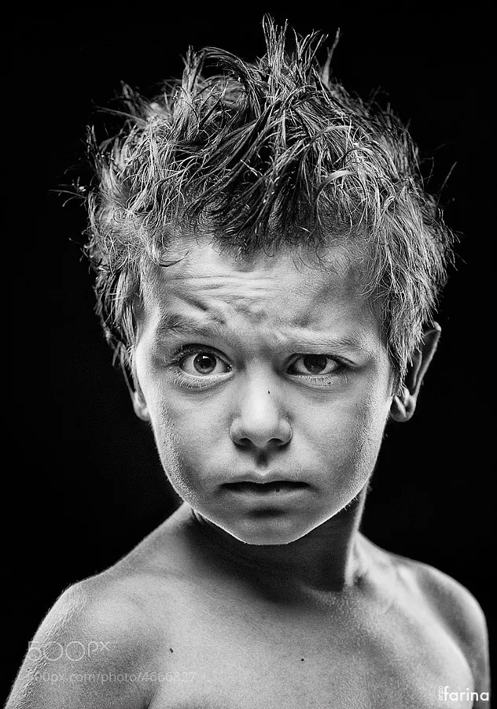
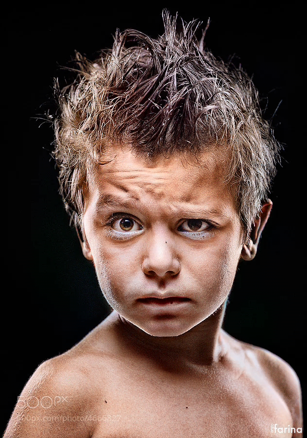

# Deep Learning Image Colorization

Deep learning based image colorization using EfficientNet and TensorFlow with a Streamlit web interface.

**Live Demo:** https://huggingface.co/spaces/dimple-dev/deep_learning_colouring

## Architecture

This codebase employs an Autoencoder architecture using Convolutional Neural Networks for image colorization. We first convert input RGB images into the LAB color space. The L (Lightness/Grayscale) channel is used as the single input to the network, which is tasked with predicting the missing A and B color channels. 

The architecture uniquely supports multiple feature extractors, prominently a pre-trained EfficientNetB0 Encoder. This Encoder captures the semantic features of the grayscale input and passes them to a robust Decoder. The Decoder applies iterative UpSampling, Convolutional layers, Batch Normalization, and ReLU activations to reconstruct the spatial resolution and predict the A and B matrices. Finally, these predicted color channels are merged with the original L channel and converted back to standard RGB format to yield the final colorized photograph.

## Output Examples

### Example 1

**Before (Grayscale Input):**

**After (Colorized Output):**

### Example 2

**Before (Grayscale Input):**

**After (Colorized Output):**

### Example 3

**Before (Grayscale Input):**

**After (Colorized Output):**

### Example 4

**Before (Grayscale Input):**

**After (Colorized Output):**

### Example 5

**Before (Grayscale Input):**

**After (Colorized Output):**

